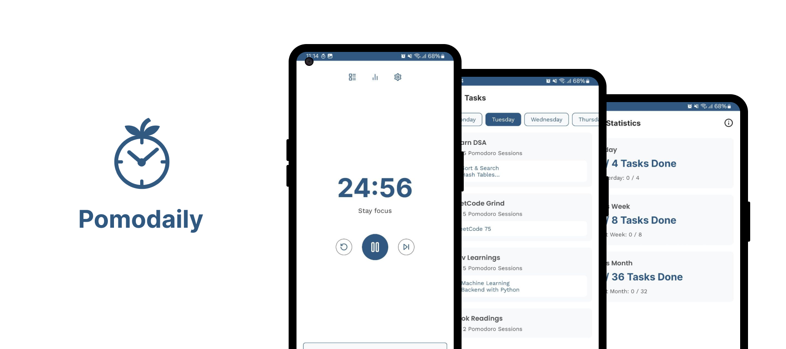

# 

### 📖 Short Explanation
Pomodaily is a productivity Android app integrating pomodoro timer, daily tasks, and progress statistics, leveraging WorkManager and foreground services to support habit-building through daily focus sessions.

---

### 🎯 Project Goals
- Users can create and manage daily tasks. 
- Start Pomodoro sessions, with or without linking to a specific task. 
- View a list of today’s to-do and completed tasks. 
- Track productivity through statistics:
    - Today vs. Yesterday
    - This Week vs. Last Week
    - This Month vs. Last Month

---

### 🛠️ Tech Stacks
- SQLDelight 
- Dagger-Hilt 
- WorkManager 
- Coroutines and Flow 
- MVVM architecture 
- Kotlin